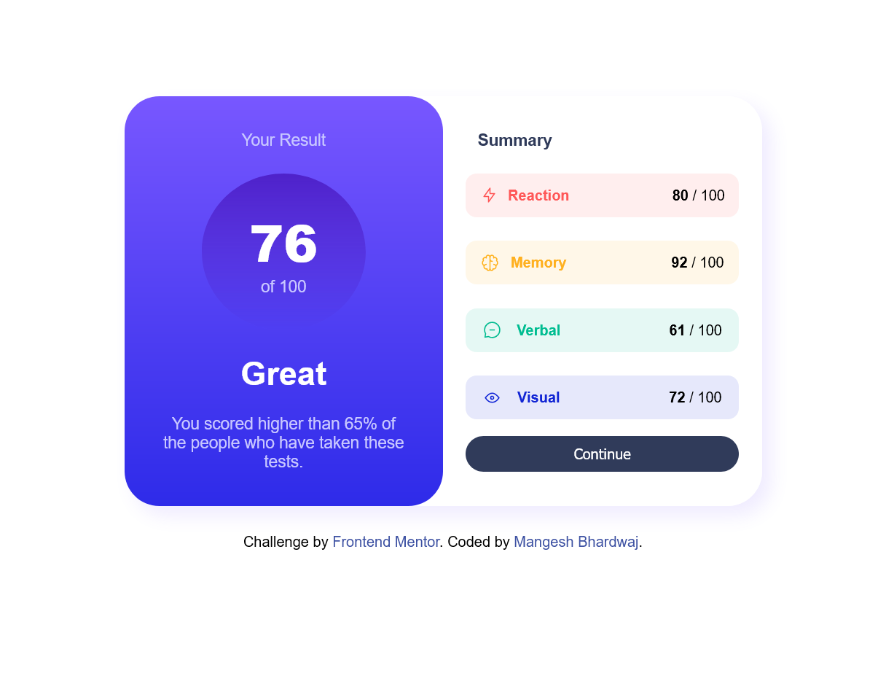
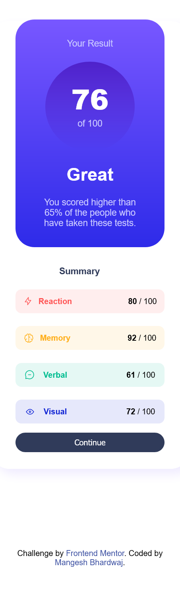

# Frontend Mentor - Results summary component solution

This is a solution to the [Results summary component challenge on Frontend Mentor](https://www.frontendmentor.io/challenges/results-summary-component-CE_K6s0maV). Frontend Mentor challenges help you improve your coding skills by building realistic projects. 

## Table of contents

- [Frontend Mentor - Results summary component solution](#frontend-mentor---results-summary-component-solution)
  - [Table of contents](#table-of-contents)
  - [Overview](#overview)
    - [Screenshot](#screenshot)
    - [Links](#links)
  - [My process](#my-process)
    - [Built with](#built-with)
  - [Continue](#continue)
  - [Author](#author)

## Overview

### Screenshot

### Links

- Solution URL: [Github](https://github.com/Mangesh636/results-summary-component-main/)
- Live Site URL: [Website](https://mangesh636.github.io/results-summary-component-main/)

## My process

### Built with

- Semantic HTML5 markup
- CSS custom properties

## Continue

Improve responsiveness on mobile device.

## Author

- Mangesh Bhardwaj
- Frontend Mentor - [Mangesh Bhardwaj](https://www.frontendmentor.io/profile/Mangesh636)
- Twitter - [Mangesh Bhardwaj](https://www.twitter.com/@MangeshSunny636)